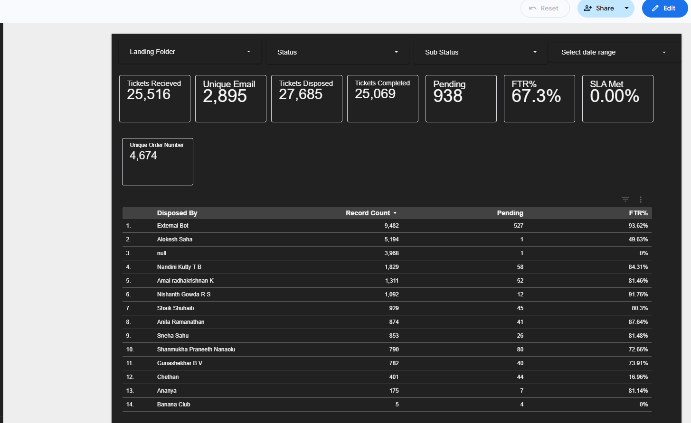
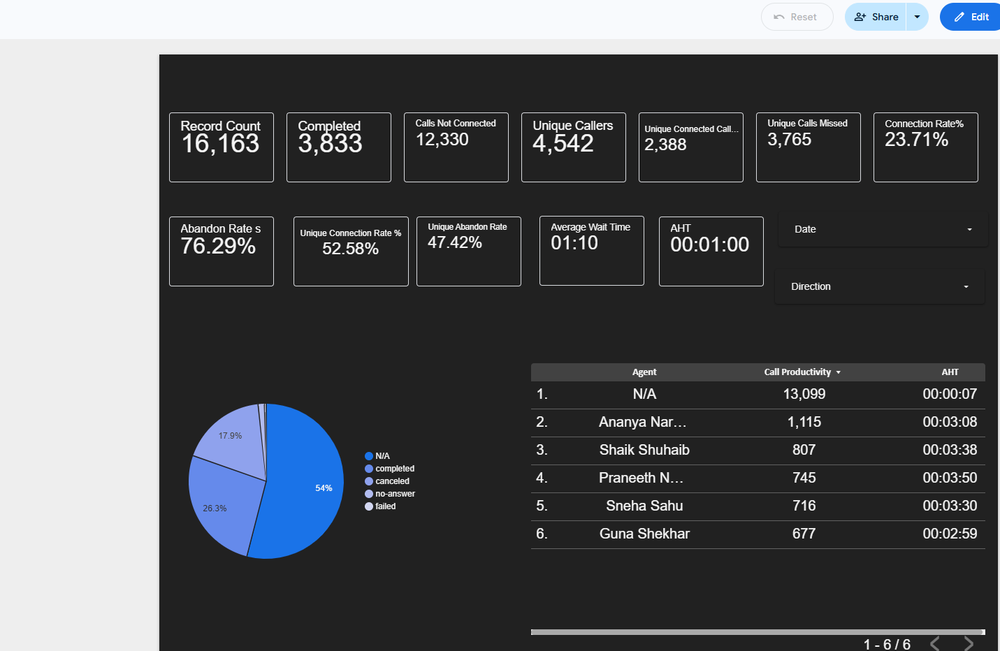
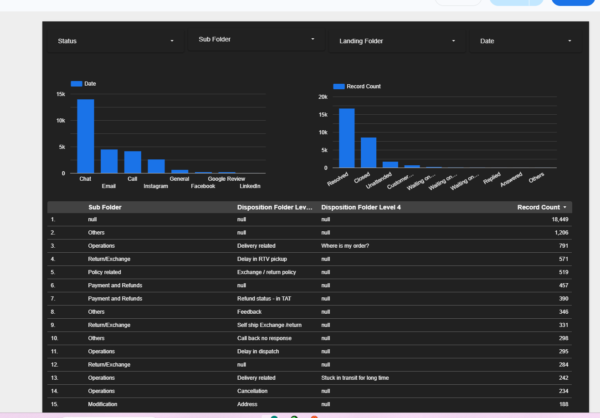

# Customer Support Operations Dashboard

An interactive business intelligence dashboard built using **Google Looker Studio** and **Google Sheets** to monitor customer support performance, operational KPIs, SLA compliance, and team productivity.

---

# 📖 Project Overview

Customer support teams often rely on multiple spreadsheets and manual reports to monitor operational performance. This project consolidates key customer support metrics into a single interactive dashboard, enabling leadership teams to make informed, data-driven decisions through real-time visualization.

The dashboard is designed to improve operational visibility, simplify reporting, and track critical customer support metrics.

---

# 🎯 Objectives

- Monitor customer support KPIs
- Track SLA performance
- Analyze ticket volume trends
- Measure team productivity
- Monitor operational performance
- Enable data-driven decision-making
- Reduce manual reporting efforts

---

# ✨ Features

- Executive KPI Dashboard
- SLA Performance Monitoring
- Ticket Volume Analysis
- Team Performance Tracking
- Interactive Filters
- Automated Google Sheets Integration
- Real-time Operational Reporting

---

# 🛠️ Tech Stack

| Tool | Purpose |
|------|---------|
| Google Looker Studio | Dashboard Development |
| Google Sheets | Data Source & Automation |
| Spreadsheet Functions | Data Transformation |
| Business Intelligence | Reporting & Analytics |

---

# 📊 Dashboard Preview

## Dashboard Overview



---

## KPI Summary



---

## Ticket Trends



---

# 📈 Key Metrics Covered

- Total Tickets
- SLA Performance
- Ticket Trends
- Team Productivity
- Operational KPIs
- Performance Monitoring

---

# 💡 Skills Demonstrated

- Business Intelligence
- Dashboard Development
- Data Visualization
- Operational Analytics
- KPI Design
- Customer Support Operations
- Reporting Automation
- Google Looker Studio
- Google Sheets
- Performance Reporting

---

# 🚀 Business Impact

This dashboard demonstrates how operational data can be transformed into meaningful business insights through interactive reporting.

### Key Benefits

- Centralized operational reporting
- Improved KPI visibility
- Faster leadership decision-making
- Reduced manual reporting effort
- Better operational performance tracking

---

# 📂 Repository Structure

```text
customer-support-operations-dashboard/
│
├── documentation/
├── sample-data/
├── screenshots/
│   ├── dashboard-overview.png.png
│   ├── kpi-summary.png.png
│   └── ticket-trends.png.png
│
├── README.md
└── LICENSE
```

---

# 🔮 Future Enhancements

- SQL Database Integration
- API-Based Data Refresh
- Predictive Analytics
- Automated Reporting
- Advanced KPI Monitoring
- Executive Performance Dashboard

---

# ⚠️ Disclaimer

This repository has been created for portfolio purposes only.

All screenshots and documentation have been anonymized. No confidential customer information, business data, or proprietary information has been shared.

---

# 👨‍💻 Author

**Alokesh Saha**

Operations | Customer Experience | Business Intelligence | Looker Studio | Google Sheets | Data Analytics
